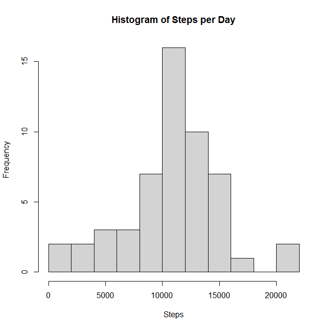
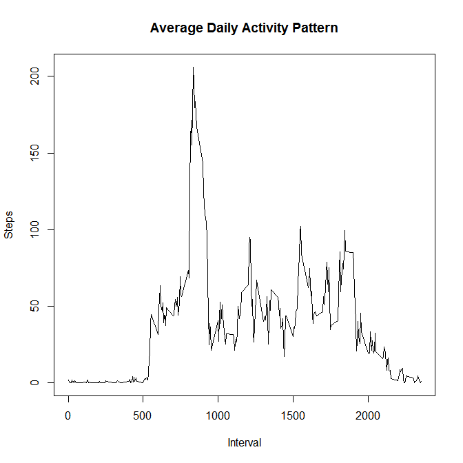
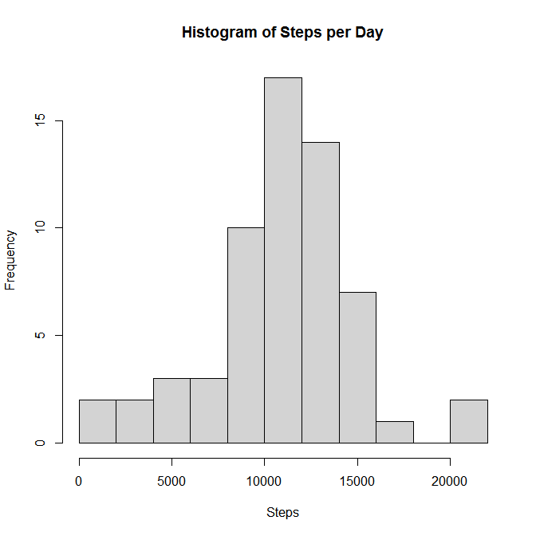
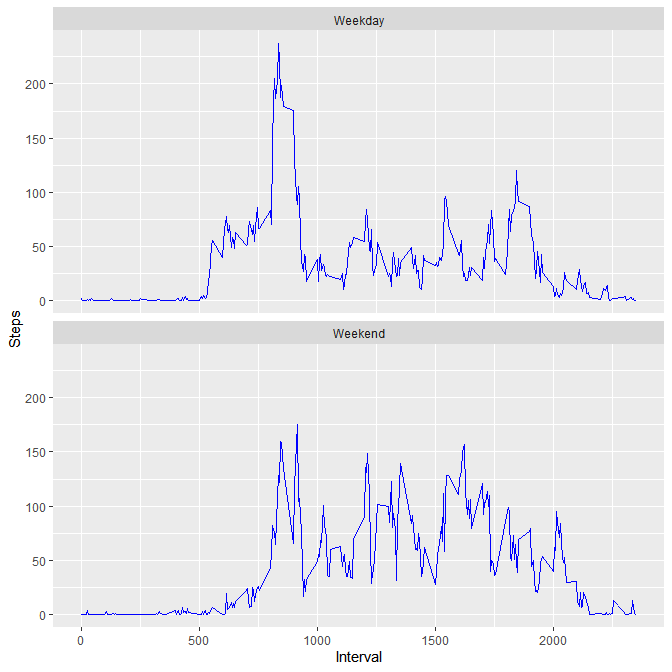

```{r setup, include=FALSE}
knitr::opts_chunk$set(echo = TRUE)
```

## Loading and preprocessing the data

```r
data <- read.csv("activity.csv")
```

## What is mean total number of steps taken per day?

```r
steps_per_day <- aggregate(steps ~ date, data, sum)
hist(steps_per_day[, "steps"], breaks = 12,
     xlab = "Steps", main = "Histogram of Steps per Day")
```

<!-- -->

```r
mean(steps_per_day[, "steps"])
```

```
## [1] 10766.19
```

```r
median(steps_per_day[, "steps"])
```

```
## [1] 10765
```

## What is the average daily activity pattern?

```r
steps_avg_interval <- aggregate(steps ~ interval, data, mean)
plot(steps_avg_interval[, "interval"], steps_avg_interval[, "steps"],
     type = "l",
     main = "Average Daily Activity Pattern",
     xlab = "Interval",
     ylab = "Steps")
```

<!-- -->

```r
idx <- which.max(steps_avg_interval[, "steps"])
steps_avg_interval[idx, "interval"]
```

```
## [1] 835
```

## Imputing missing values

```r
sum(is.na(data))
```

```
## [1] 2304
```

```r
data$date <- as.Date(data$date)
data$day <- weekdays(data$date)
data_sep <- aggregate(steps ~ (interval + day), data, mean, na.rm = T)
data_impute <- merge(data, data_sep, by = c("interval", "day"))
data_impute <- transform(data_impute,
                         steps.x = ifelse(is.na(steps.x),
                                          steps.y, steps.x))
data_impute <- data.frame(data_impute[, 1 : 4])
names(data_impute) <- c("interval", "day", "steps", "date")
data_impute$steps <- round(data_impute$steps, digits = 0)
data_impute <- data_impute[order(data_impute$date,
                                 data_impute$interval), ]

impute_steps_per_day <- aggregate(steps ~ date, data_impute, 
                                  sum, na.rm = T)
hist(impute_steps_per_day[, "steps"], breaks = 12,
     xlab = "Steps", main = "Histogram of Steps per Day")
```

<!-- -->

```r
mean(impute_steps_per_day[, "steps"])
```

```
## [1] 10821.1
```

```r
median(impute_steps_per_day[, "steps"])
```

```
## [1] 11015
```
Both the mean and the median differ from the previous values. The main effect of the imputation on the histogram is that the frequency of 10,000 - 15,000 steps taken per day increases.

## Are there differences in activity patterns between weekdays and weekends?

```r
data_impute$type <- ifelse(data_impute$day %in% c("Saturday", "Sunday"),
                           "Weekend", "Weekday")
data_impute_per_itvtype <- aggregate(steps ~ (interval + type),
                                     data_impute, mean, na.rm = T)
library(ggplot2)
ggplot(data_impute_per_itvtype, aes(x = interval, y = steps)) + 
  geom_line(color="blue") + 
  facet_wrap(~type, nrow = 2, ncol = 1) + 
  labs(x = "Interval",y = "Steps")
```

<!-- -->
